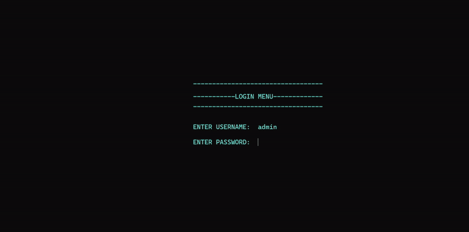
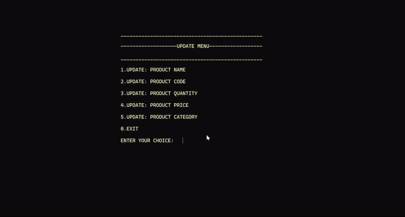
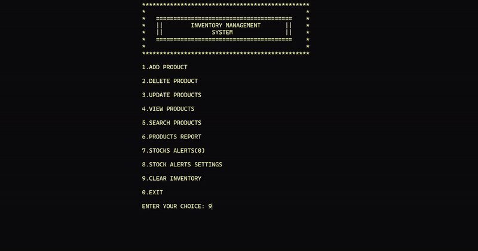
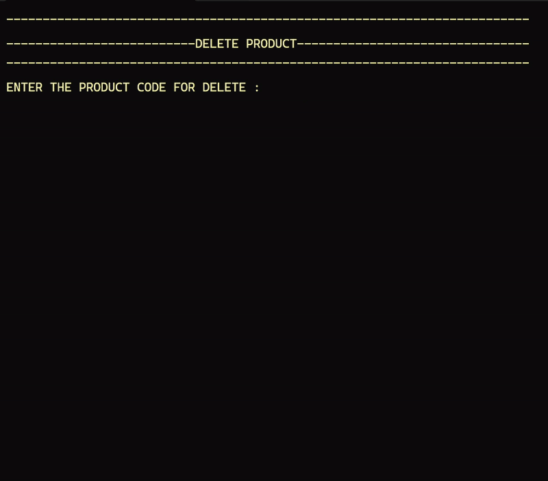
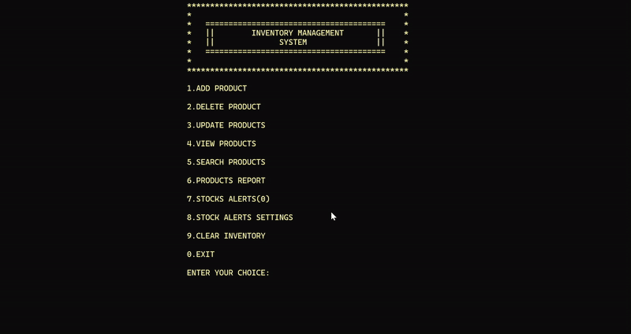

# Inventory Management System 🛒

## Project Overview
The **Inventory Management System** is a console-based application developed in C language. It allows users to efficiently manage product stock, perform CRUD (Create, Read, Update, Delete) operations, and maintain accurate records of inventory.

## Preview
## 🎥 CLI Feature Showcase

### 🔐 Authentication

### ➕ Add Product

### 🔄 Update Product

### 🔍 Search Product

### 🧹 Clear Inventory

### ❌ Delete Product

### 🚨 Low Stock Alert

## Features 🚀
- **User Authentication** 🔑
- **Product Management**:
  - Add New Products ➕
  - Delete Products ❌
  - Update Product Information 🔄 (Name, Code, Quantity, Price, Category)
- **Search Products** 🔍 by:
  - Name
  - Code
  - Category
  - Price
- **Additional Features**:
  - View All Products 📄
  - Inventory Reports 📊
  - Low Stock Alerts ⚠️
  - Clear Inventory 🗑️
  - Custom Stock Alert Settings ⚙️

## Technologies Used 🛠️
- ✅ C Programming Language
- ✅ File Handling
- ✅ Console Graphics (Windows API)
- ✅ System Beep Alerts 🔔

## How to Use 🎯
1. Launch the application.
2. Login using the following credentials:
   - **Username**: `admin`
   - **Password**: `pass`
3. Choose from the menu options to perform various inventory management tasks.

## File Structure 📁
- 📌 `PROJECT.bin`: Stores product records.
- 📌 `TEMP.bin`: Temporary storage file for updating records.

## Stock Alerts ⚡
- The system notifies the user when product quantities fall below the user-defined minimum stock level.

## Contributors 👥
- 🎓 **Muzamil Suleman** (24K-1023)
- 🎓 **Hasheem Shuja** (24K-0521)
- 🎓 **Syed Muzammil Zaidi** (24K-0887)
- 🎓 **Ali Asghar** (24K-0780)

## License 📜
- This project is licensed under the **MIT License**.

## Acknowledgements 🙌
- Special thanks to **FAST NUCES Karachi** for providing the platform to create this project.
